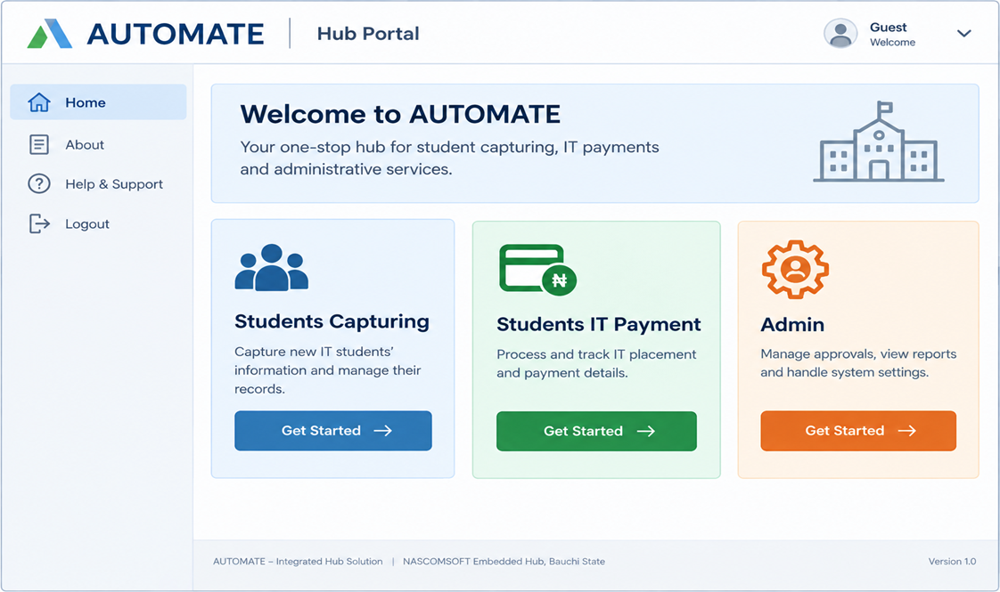

# AUTOMATED STUDENT RECORD PAYMENT MANAGEMENT SYSTEM
## PRODUCT REQUIREMENTS DOCUMENT (PRD) — MVP

### Document Details
| Item | Details |
| :--- | :--- |
| **Project / Team** | AUTOMATE — Hackathon 2.0 |
| **Product** | Automated Student Record Payment Management System |
| **Primary Users** | IT Students and Administrators |
| **Platform** | Responsive Web Portal |
| **MVP Status** | Hackathon MVP / Deployable Prototype |

---

## 1. Product Summary
A centralized web system that automates the student journey from eligibility testing and department capacity checking through student registration, Paystack payment verification, confirmation, email communication, and administrative reporting. The central database is the authoritative record; Excel is used for controlled reporting/export.

---

## 2. Problem Statement
Student registration can involve fragmented forms, manual eligibility checks, uncertain department capacity, payment reconciliation, and repetitive record entry. These steps increase delays, duplicate records, and administrative workload. **AUTOMATE** addresses this with one traceable workflow that enforces business rules and gives administrators a single operational dashboard.

---

## 3. Product Goal & SMART Objectives
**Goal:** Create a reliable, rule-driven student registration workflow that reduces manual work while improving payment traceability and administrative visibility.

| Objective | SMART Target / Measure |
| :--- | :--- |
| **1. Eligibility** | By MVP completion, automate the 10-question assessment with a ≥60% pass rule, record every attempt/result, and enforce a maximum of 3 attempts. |
| **2. Registration & Payment** | By MVP completion, automate capacity check → capturing → Paystack verification and reduce admin manual entry time by 80%; target 200 registrations and <2% payment failure in pilot/testing. |
| **3. Administration** | By MVP completion, centralize 100% of completed registrations and provide dashboard/export reporting generated in <5 minutes, including fees and department frequency. |

---

## 4. Target Users & Value Proposition

| User | Needs / Value Proposition |
| :--- | :--- |
| **IT Student** | Fast eligibility test, guided registration, secure payment, confirmation, and complete email details. |
| **Administrator** | Protected dashboard, searchable records, payment status, department capacity visibility, charts, and Excel export. |

---

## 5. Proposed Solution & User Experience
The portal presents four major options: **Student Capturing**, **Payment**, **Confirmation**, and protected **Admin**. Student Capturing begins with the eligibility test. Only students who pass can continue. Registration is validated against department capacity before personal details are saved. Payment is completed through Paystack and accepted only after backend/webhook verification.

### 5.1 Student Journey

| Step | System Behaviour |
| :---: | :--- |
| **1. Landing + Test** | Student starts a 10-question test covering computer software/programming and hardware/maintenance. |
| **2. Eligibility** | Score is calculated automatically. ≥60% passes; <60% fails. Attempt is stored. Maximum 3 attempts. |
| **3. Department** | Available departments are shown with capacity. Full departments are blocked; capacity is enforced server/database-side. |
| **4. Capturing** | Student enters name, email, phone, institution, IT/study duration, and other required fields. |
| **5. Payment** | System initiates Paystack payment using the applicable department fee. |
| **6. Verification** | Verify payment via Paystack webhook + backend before confirmation. |
| **7. Confirmation** | Verified payment produces confirmation and email containing receipt/reference, registration details, department, fee, and programme timetable. |

### 5.2 Screen Flow

`Landing/Test` ➔ `Department` ➔ `Capturing` ➔ `Paystack` ➔ `Verified Receipt` ➔ `Admin records/reporting`

### 5.3 Required Screens
1. Landing + Test
2. Department Select
3. Capturing Form
4. Paystack
5. Receipt
6. Admin Dashboard

---

## 6. Functional Requirements

| ID | Requirement | Description |
| :--- | :--- | :--- |
| **FR-01** | Portal Navigation | Show Student Capturing, Payment, Confirmation, and protected Admin entry points. |
| **FR-02** | Eligibility Test | Present 10 questions covering computer software/programming and hardware/maintenance. |
| **FR-03** | Automatic Scoring | Calculate score automatically and apply a 60% pass threshold. |
| **FR-04** | Attempt Control | Store attempts/results; allow at most 3 attempts; block progression after a third failure. |
| **FR-05** | Department Capacity | Display department availability and prevent selection of full departments. |
| **FR-06** | Capacity Integrity | Enforce capacity at backend/database level to prevent simultaneous overbooking. |
| **FR-07** | Student Capturing | Collect name, email, phone, institution, IT duration, and required registration fields. |
| **FR-08** | Payment Verification | Verify payment via Paystack webhook + backend before confirmation. |
| **FR-09** | Payment Record | Store amount, Paystack reference, status, timestamps, and linked registration. |
| **FR-10** | Department Fee | Apply the configured fee for the selected department/registration. |
| **FR-11** | Confirmation | Show successful confirmation only after verified payment. |
| **FR-12** | Email Details | Send congratulatory email with receipt/reference, registration details, department, fee, and timetable. |
| **FR-13** | Admin Authentication | Require authenticated admin access; credentials must be protected server-side, not hard-coded in public frontend code. |
| **FR-14** | Admin Dashboard | Show registrations, total fees, department distribution/frequency, and payment status. |
| **FR-15** | Search / Filter | Allow administrators to search and filter registration/payment records. |
| **FR-16** | Excel Export | Export complete registration records to `.xlsx` monthly or on demand. |
| **FR-17** | Email Failure Recovery | If Paystack succeeds but email fails, queue the email, log its status, and allow a Resend Receipt action. |
| **FR-18** | Duplicate Payment Protection | Prevent duplicate confirmed payments from the same Paystack reference and keep payment processing idempotent. |

---

## 7. Non-Functional Requirements

| Area | MVP Requirement |
| :--- | :--- |
| **Performance** | Core pages should respond quickly under expected load; admin report generation <5 minutes. |
| **Responsive Design** | Mobile-first layout with practical breakpoints for small phones, tablets, and desktop; no horizontal scrolling on core screens. |
| **Accessibility** | Keyboard-accessible test questions, visible focus states, clear labels, readable contrast, and useful validation messages. |
| **Security** | HTTPS; server-side authorization; input validation; protected secrets; hashed credentials; webhook signature verification; payment logs. |
| **Privacy / Retention** | Collect only required student PII; define a retention period before deployment; restrict access and delete/anonymize records when approved period expires. |
| **Reliability** | Webhook retries/idempotency; email queue/retry; transactional registration/capacity operations. |

---

## 8. MVP Scope & Prioritization

| Priority | Features Included |
| :--- | :--- |
| **P0 — Must** | Eligibility test/scoring/3-attempt control; department capacity; student capturing; Paystack; webhook/backend verification; confirmation; email; admin auth; dashboard; Excel export. |
| **P1 — Should** | Search/filter; email resend; audit log; configurable department capacity/fees; timetable management. |
| **P2 — Later** | Advanced analytics, SMS/WhatsApp notifications, student self-service portal, multi-role workflows, and expanded integrations. |

---

## 9. System Architecture & Technical Design
Recommended architecture: a **modular monolith** suitable for a 3-week hackathon MVP. The browser provides the interface; the application server enforces business rules and integrations; PostgreSQL stores authoritative records.

| Layer | Recommended Technology / Role |
| :--- | :--- |
| **Frontend** | Next.js + React + TypeScript; Tailwind CSS + shadcn/ui; responsive forms and dashboard. |
| **Backend** | Next.js server/API routes; Zod validation; server-side business rules and authorization. |
| **Database** | PostgreSQL + Prisma ORM; transactions and unique constraints for capacity/payment integrity. |
| **Authentication** | Secure session-based admin authentication / Auth.js; server-side protected credentials. |
| **Payment** | Paystack API + webhook; backend verification; idempotent payment processing. |
| **Email** | Transactional email provider with queue/retry and delivery status logging. |
| **Reporting** | SheetJS (`xlsx`) for `.xlsx` export; Recharts for dashboard visualizations. |
| **Testing / Deployment** | Vitest + Playwright; Git/GitHub; Vercel + managed PostgreSQL. |

### 9.1 Core Data Entities
* `Student`
* `EligibilityAttempt`
* `EligibilityResult`
* `Department`
* `Registration`
* `Payment`
* `TimetableEntry`
* `Admin/User`
* `AuditLog`

### 9.2 Critical Business Rules
1. **Eligibility:** Pass score = ≥60%; maximum 3 attempts; third failure blocks progression.
2. **Access Control:** Only passing students can reach department selection and capturing.
3. **Capacity Control:** Department capacity is checked and reserved transactionally to prevent race-condition overbooking.
4. **Payment Verification:** Payment is not confirmed from browser redirect alone; Paystack webhook/backend verification is authoritative.
5. **Idempotency:** Paystack reference must be unique for confirmed payment; duplicate webhook events must not create duplicate records.
6. **Data Source:** Central database is authoritative; Excel exports are reporting copies.

---

## 10. Acceptance Criteria & Success Metrics

| Measure | Target |
| :--- | :--- |
| **Registrations** | Process 200 registrations during pilot/test. |
| **Payment Reliability** | Payment failure rate <2% during measured pilot/test. |
| **Manual Work** | Reduce admin manual entry time by 80%. |
| **Reporting** | Admin report/export generated in <5 minutes. |
| **Eligibility** | 100% of test scores calculated automatically; 60% and 3-attempt rules enforced. |
| **Core Quality** | At least 90% of core test cases pass before demo. |

---

## 11. Risks, Constraints & Assumptions

| Risk / Constraint | Mitigation / Assumption |
| :--- | :--- |
| **Payment verification failure** | Use webhook + backend verification, retries, and idempotency; never treat browser success as final proof. |
| **Duplicate payment/webhooks** | Unique Paystack reference constraint and idempotent processing. |
| **Email deliverability** | Log email status, queue/retry failed delivery, and show a Resend Receipt action. |
| **Department overbooking** | Use server/database transaction and capacity constraint rather than frontend-only checks. |
| **Student PII exposure** | Least-privilege access, protected admin routes, HTTPS, secure secrets, and defined retention policy. |
| **Hackathon time** | Prioritize P0 requirements; avoid unnecessary microservices and complex infrastructure. |
| **Internet/payment dependency** | Show clear pending/failure states and preserve registration/payment status for recovery. |

---

## 12. Development Plan — 3-Week MVP

| Week | Monday–Thursday Focus | Friday Deliverable / Pitch Progress |
| :---: | :--- | :--- |
| **Week 1 — Planning & Design** | Requirements freeze; user flows; database schema; wireframes; API contracts; UI design; security/privacy checklist. | Design review, clickable flow/prototype, and architecture explanation. |
| **Week 2 — Foundation** | Repository; database; authentication; eligibility engine; department capacity; capturing; initial dashboard. | Working end-to-end registration skeleton and progress demo. |
| **Week 3 — Completion & Testing** | Paystack; webhook verification; email; export; charts; edge cases; responsive/accessibility testing; bug fixes. | Final MVP demo, test results, metrics, and pitch-ready build. |

---

## 13. Definition of Done
* [x] Student can complete eligibility, pass, select an available department, submit required details, and reach Paystack.
* [x] Verified payment creates one authoritative payment record and confirmation.
* [x] Successful payment triggers email; email failures are logged/retried and can be resent.
* [x] Admin can securely sign in, search/filter records, view key charts, and export `.xlsx` data.
* [x] Capacity, duplicate payment, and 3-attempt rules are enforced server-side.
* [x] Responsive/accessibility checks and core tests are completed before the demo.

---

## 14. Open Questions / Configuration Before Deployment
* Confirm final department list and capacities.
* Confirm department-specific fees and final timetable.
* Finalize required student fields.
* Establish approved PII retention period.
* Configure Paystack keys and webhook endpoint URL.
* Configure transactional email sender credentials.
* Set up authorized administrator credentials.
